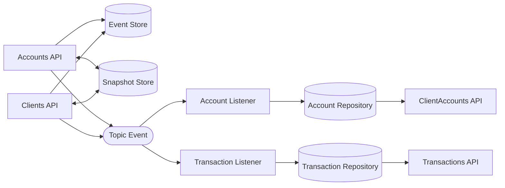

# event-sourcing-bank

```mermaid
flowchart LR
    AccountsAPI[Accounts API]
    ClientsAPI[Clients API]
    EventStore[(Event Store)]
    SnapshotStore[(Snapshot Store)]
    Topic([Topic Event])
    AccountListener[Account Listener]
    TransactionListener[Transaction Listener]
    AccountRepository[(Account Repository)]
    TransactionRepository[(Transaction Repository)]
    ClientAccountsAPI[ClientAccounts API]
    TransactionsAPI[Transactions API]

    AccountsAPI --> Topic
    ClientsAPI --> Topic
    AccountsAPI --> EventStore
    ClientsAPI --> EventStore
    AccountsAPI <--> SnapshotStore
    ClientsAPI <--> SnapshotStore

    Topic --> AccountListener
    Topic --> TransactionListener

    AccountListener --> AccountRepository --> ClientAccountsAPI
    TransactionListener --> TransactionRepository --> TransactionsAPI
```
